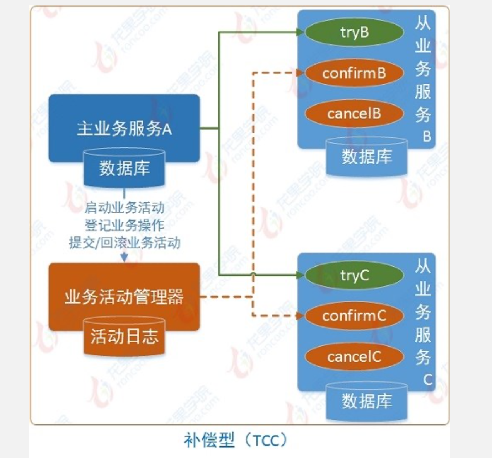

# TCC模型(TCC事务补偿型)

> 也属于两阶段型的一种实现，但区别于2PC协议的两阶段提交

XA是一个应用连接多个库，TCC模型不是直接操作多个库；而是在框架层实现；

TCC 的全称是：Try、Confirm、Cancel。

Try 阶段：这个阶段说的是对各个服务的资源做检测以及对资源进行锁定或者预留。
Confirm 阶段：这个阶段说的是在各个服务中执行实际的操作。
Cancel 阶段：如果任何一个服务的业务方法执行出错，那么这里就需要进行补偿，就是执行已经执行成功的业务逻辑的回滚操作。（把那些执行成功的回滚）
这种方案说实话几乎很少人使用，我们用的也比较少，但是也有使用的场景。因为这个事务回滚实际上是严重依赖于你自己写代码来回滚和补偿了，会造成补偿代码巨大，非常之恶心。

比如说我们，一般来说跟钱相关的，跟钱打交道的，支付、交易相关的场景，我们会用 TCC，严格保证分布式事务要么全部成功，要么全部自动回滚，严格保证资金的正确性，保证在资金上不会出现问题。

而且最好是你的各个业务执行的时间都比较短。

但是说实话，一般尽量别这么搞，自己手写回滚逻辑，或者是补偿逻辑，实在太恶心了，那个业务代码是很难维护的。

