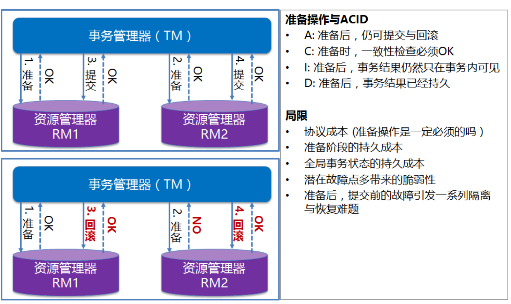

# 全局事务DTP模型

- AP(Application Program):也就是应用程序， 可以理解为使用 DTP 的程序;
- RM(Resource Manager):资源管理器(这里 可以是一个 DBMS，或者消息服务器管理系统) 应用程序通过资源管理器对资源进行控制，资 源必须实现 XA 定义的接口;
- TM(Transaction Manager):事务管理器，负 责协调和管理事务，提供给 AP 应用程序编程 接口以及管理资源管理器。
- 事务管理器控制着全局事务，管理事务生命周 期，并协调资源。资源管理器负责控制和管理 实际资源。
- XA是由X/Open组织提出的分布式事务的规范。 XA规范主要定义了(全局)事务管理器(TM)和(局 部)资源管理器(RM)之间的接口。主流的关系型 数据库产品都是实现了XA接口的。
- XA接口是双向的系统接口，在事务管理器 (TM)以及一个或多个资源管理器(RM)之 间形成通信桥梁。
- XA之所以需要引入事务管理器是因为，在分布 式系统中，从理论上讲两台机器理论上无法达 到一致的状态，需要引入一个单点进行协调。
- 由全局事务管理器管理和协调的事务，可以跨 越多个资源(如数据库或JMS队列)和进程。 全局事务管理器一般使用 XA 二阶段提交协议 与数据库进行交互。

# 两阶段提交(Two Phase Commit)

- 两阶段提交协议(Two-phase commit protocol) 是XA用于在全局事务中协调多个资源的机制。
- TM和RM间采取两阶段提交(Two Phase Commit) 的方案来解决一致性问题。
- 两阶段提交需要一个协调者(TM)来掌控所有参与 者节点(RM)的操作结果并且指引这些节点是否需 要最终提交。

# JavaEE平台中的分布式事务实现

- JTA(Java Transaction API):面向应用、应用服务器与资 源管理器的高层事务接口。
- JTS(Java Transaction Service):JTA事务管理器的实现标 准，向上支持JTA，向下通过CORBA OTS实现跨事务域的互 操作性。
- EJB:基于组件的应用编程模型，通过声明式事务管理进一步 简化事务应用的编程。

## 优点
• 简单一致的编程模型
• 跨域分布处理的ACID保证
##  局限
• DTP模型本身的局限

# 标准分布式事务解决方案的利弊
优点:严格的ACID

缺点:效率非常低(微服务架构下已不太适用)

-  全局事务方式下，全局事务管理器(TM)通过XA接口使用二阶段提交协议( 2PC )与资源层(如数据 库)进行交互。使用全局事务，数据被Lock的时间跨整个事务，直到全局事务结束。
- 2PC 是反可伸缩模式，在事务处理过程中，参与者需要一直持有资源直到整个分布式事务结束。这样， 当业务规模越来越大的情况下，2PC 的局限性就越来越明显，系统可伸缩性会变得很差。
- 与本地事务相比，XA 协议的系统开销相当大，因而应当慎重考虑是否确实需要分布式事务。而且只有 支持 XA 协议的资源才能参与分布式事务。

# BASE理论

BASE
• BA: Basic Availability 基本业务可用性(支持分区失败)
• S: Soft state 柔性状态(状态允许有短时间不同步，异步)
• E: Eventual consistency 最终一致性(最终数据是一致的，但不是实时一致)
- 原子性(A)与持久性(D)必须根本保障
- 为了可用性、性能与降级服务的需要，只有降低一致性( C ) 与 隔离性( I ) 的要求

# CAP定理

定理: 对于共享数据系统，最多只能同时拥有CAP其中 的两个，没法三者兼顾。
• 任两者的组合都有其适用场景
• 真实系统应当是ACID与BASE的混合体 • 不同类型的业务可以也应当区别对待

# 柔性事务

## TCC（两阶段型，补偿型）

## 异步确保型

- 可靠消息最终一致
- 基于本地消息表
- 独立的消息服务
## 最大努力通知型（非可靠消息 、定期校对）
