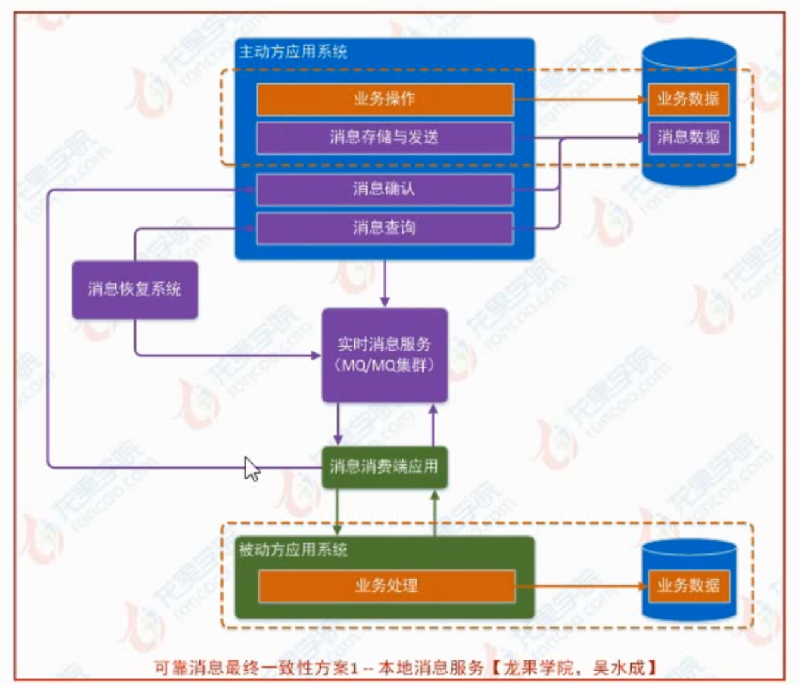
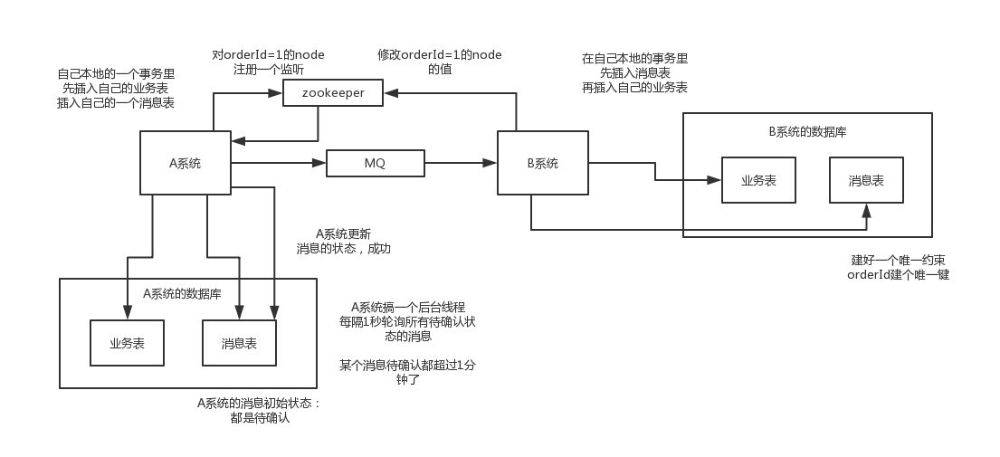

# 基于本地消息表

本地消息表其实是国外的 ebay 搞出来的这么一套思想。

这个大概意思是这样的：

1. A 系统在自己本地一个事务里操作同时，插入一条数据到消息表；
2. 接着 A 系统将这个消息发送到 MQ 中去；
2. B 系统接收到消息之后，在一个事务里，往自己本地消息表里插入一条数据，同时执行其他的业务操作，如果这个消息已经被处理过了，那么此时这个事务会回滚，这样保证不会重复处理消息；
3. B 系统执行成功之后，就会更新自己本地消息表的状态以及 A 系统消息表的状态；
4. 如果 B 系统处理失败了，那么就不会更新消息表状态，那么此时 A 系统会定时扫描自己的消息表，如果有未处理的消息，会再次发送到 MQ 中去，让 B 再次处理；
5. 这个方案保证了最终一致性，哪怕 B 事务失败了，但是 A 会不断重发消息，直到 B 那边成功为止。

这个方案说实话最大的问题就在于严重依赖于数据库的消息表来管理事务啥的，如果是高并发场景咋办呢？咋扩展呢？所以一般确实很少用。

