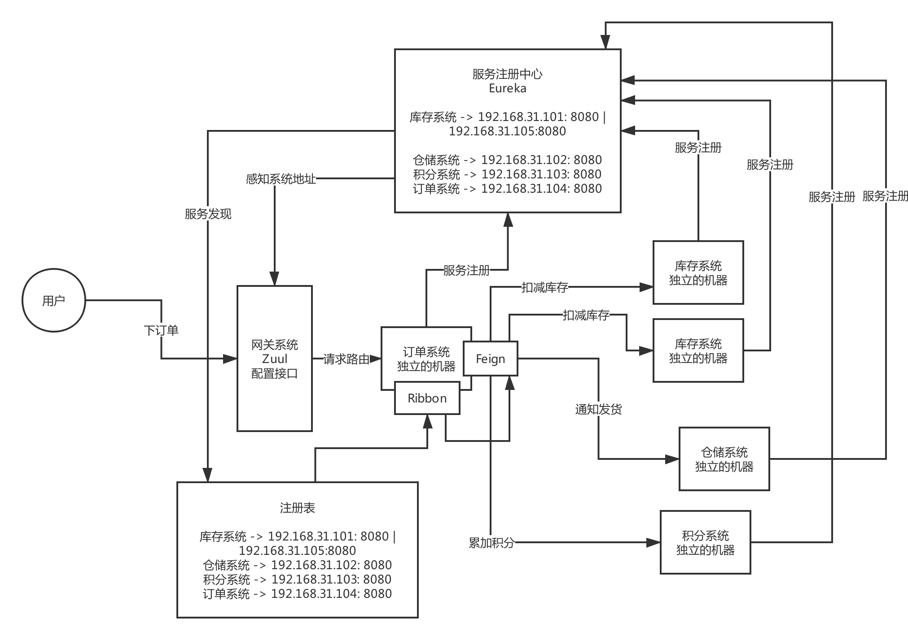

# 分布式系统引入

电商系统：
订单系统，库存系统，仓库系统，积分系统

10万注册用户，日活1000用户
如果百万注册用户，日活万级、十万级别；那么单体系统就不合适了；需要使用分布式系统。

下订单：
订单系统本地
订单系统 -> 调用库存系统，减库存
订单系统 -> 调用仓库系统，通知发货
订单系统 -> 调用积分系统，加积分

多个子系统相互协作，完成功能。

# SpringCloud

如果你基于Spring Cloud对外发布一个接口，实际上就是支持http协议的，对外发布的就是一个最最普通的Spring MVC的http接口

## 服务注册
注册中心比如： Eureka
Eureka中有服务注册表

比如：
库存系统 192.168.0.101:8080 | 192.168.0.111:8080
仓库系统 192.168.0.102:8080 | 192.168.0.112:8080
积分系统 192.168.0.103:8080

## 服务发现
服务注册信息，每个服务会缓存在本地

## 服务调用
比如：Feign
SpringCloud基于Http请求调用的

feign，他是对一个接口打了一个注解，他一定会针对这个注解标注的接口生成动态代理，然后你针对feign的动态代理去调用他的方法的时候，此时会在底层生成http协议格式的请求，/order/create?productId=1

底层的话，使用HTTP通信的框架组件，HttpClient，先得使用Ribbon去从本地的Eureka注册表的缓存里获取出来对方机器的列表，然后进行负载均衡，选择一台机器出来，接着针对那台机器发送Http请求过去即可

配置一下不同的请求路径和服务的对应关系，你的请求到了网关，他直接查找到匹配的服务，然后就直接把请求转发给那个服务的某台机器，Ribbon从Eureka本地的缓存列表里获取一台机器，负载均衡，把请求直接用HTTP通信框架发送到指定机器上去

## 负载均衡
比如：Ribbon
服务调用的时候进行负载均衡

## 网关
Zuul/ Spring Cloud Gateway

这么多的系统，电商系统包含了20个子系统，每个子系统有20个核心接口，一共电商系统有400个接口，这么多的接口，直接对外暴露，前后端分离的架构，难道你让前端的同学必须记住你的20个系统的部署的机器，他们去做负载均衡，记住400个接口

服务不会直接暴露给前端，而是中间加一个网关

将服务暴露的接口配置在网关中，并且网关能感知到服务的地址。调用方不需要关心接口的具体地址，只需要调用网关，网关是知道服务的地址的。

网关还可以做些其他的事情：灰度发布，统一的限流，统一的熔断(超过的流量不调用)，统一的降级(服务异常时))，统一的授权认证

#### 网关功能
动态路由、灰度发布、统一熔断、统一降级、统一缓存、统一限流、统一授权认证

其他：
Hystrix，链路追踪，Hystrix会放在高可用那边说

