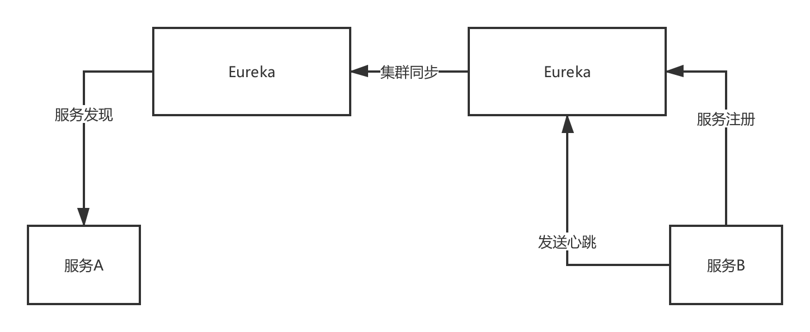

Eureka(SpringCloud), Zeekeeper(Dubbo), Consul, Nacos

## Eureka服务注册中心原理

注册中心： 服务注册表

服务：启动的时候，进行服务注册(注册到服务注册表中)

多级缓存： 服务注册表，ReadWrite缓存，ReadOnly缓存
为什么用多级缓存？避免了服务注册中心读写的并发冲突问题，如果不用多级换内存，就得通过加锁的方式来解决。

新服务注册进来时，会注册到注册表中，然后同步到ReadWrite缓存中。

ReadOnly缓存通过定时30s拉取进行同步，也就是说，服务消费者不能立马感知到服务提供者的信息。需要等到定时拉取配置的时候，同时ReadOnly缓存已经更新的话，才能感知到新的服务。

客户端会定时30s从ReadOnly缓存拉取注册信息。

Eureka注册中心的默认配置会发现一个问题：服务启动后，生产者发现的比较慢。

服务启动后，会通过心跳来维持连接。注册中心会定时检查每个服务是否没有心跳了(连续90s没有心跳)。如果发现某个服务挂了，会将注册表中的和ReadWrite缓存中该服务的信息清除。

ReadOnly缓存是通过定时任务去同步检查更新的。

### Eureka注册中心集群原理
Peer-To-Peer对等方式，部署一个集群，集群中任何一个节点都是对等的，可以向任何一个节点进行服务注册和服务发现，集群中任何一个Eureka节点接收到写请求后，会自动同步给其他的节点

如果我们只配置一个Eureka服务端，那么如果这个服务端崩盘，那么所有服务都无法获取，这肯定不是我们不期望的。所以为了保证高可用性，我们需要搭建Eureka集群。

前面讲原理时已经提到Eureka Server在启动时默认会注册自己，成为一个服务，所以Eureka Server也是一个客户端。也就是说们我们可以配置多个Eureka Server，让他们之间相互注册，当服务提供者向其中一个Eureka注册服务时，这个服务就会被共享到其他Eureka上，这样所有的Eureka都会有相同的服务。

## Zookeeper服务注册原理

* 选举leeader节点
* 服务注册，会注册到leader上
* leader将注册信息同步到floower上去
* 注册监听服务列表更新，反向通知
* 当服务挂了的话，Leader感知到，然后同步到Floowers，然后反向通知给客户端

服务注册和发现的原理，Leader+Followers两种角色，只有Leader可以负责写(服务注册)，然后将数据同步给Followers，读的时候Leader和Followers都可以读。

## CP、AP模型
CAP，C是一致性，A是可用性，P是分区容错性

CP，AP

ZooKeeper(CP模型)是有一个leader节点会接收数据， 然后同步写其他节点，一旦leader挂了，要重新选举leader，这个过程里为了保证C，就牺牲了A，不可用一段时间，但是一个leader选举好了，那么就可以继续写数据了，保证一致性

Eureka(AP模型)是peer模式，可能还没同步数据过去，结果自己就死了，此时还是可以继续从别的机器上拉取注册表，但是看到的就不是最新的数据了，但是保证了可用性，强一致，最终一致性

## Eureka和zk对比

### 一致性

CP vs AP C:一致性 A:可用性 P:分区
CAP不可兼得，要么CP，要么AP，P分布式必须满足

zk: CP模型，保证一致性(CP模型会在极端情况下，整个集群短暂不可用)

* 当向Leader写的时候，同步到Followers
* 当向Leader写的时候，Leader挂了，还没来得及同步，那么此时数据是不一致的
* 当向Leader写的时候，Leader挂了(zk选择强一致，放弃了可用性)，通过：必须重新选举Leader; 选举期间，zk都不允许访问，保证了强一致
* 当重新选举了leeader后，由新leader同步到其他的Followers
* 在同步期间，牺牲了可用性，换来了强一致性。

Eureka: AP模型，保证可用性(极端情况下，仍然可用，但是存在不一致的情况)
* 当向Leader写的时候，Leader挂了，还没来得及同步，那么此时数据是不一致的
* 其他节点仍然可用，可以从其他节点读取信息，但是此时读到的信息不一致；
* 但是其他Eureka节点可以接收通信，可以达到最终一致性
* 牺牲一致性，放弃强一致性，选择最终一致性

### 服务注册于发现的时效性

zk
* 秒级，几乎立马感知到

eureka
* 不管怎么优化，时效性都非常差，几十秒级，甚至分钟级别
* 极端情况下，服务注册，需要30s才会同步ReadOnly缓存；极端情况下，服务发现需要30s客户端才会同步readOnly的缓存
* 服务故障的时候，定时任务60s才会检查:(超过90s没有收到心跳的才会更新注册表[一级和二级])

### 容量

zk不适合太多的服务实例，因为服务上线下线的时候，需要瞬间推送数据通知其他的所有的服务实例，所以一旦服务规模太大，到了几千，会导致网络带宽被大量占用。

eureka也不适合大规模服务实例，原因在于peer-to-peer，每个实例都要接受所有的请求，