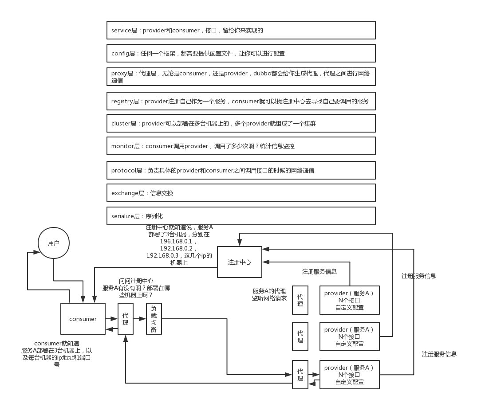

服务提供者： 
向注册中心暴露服务接口
服务注册：服务提供者，启动的时候在注册中心注册该服务的接口(地址，端口号)

服务消费者：
服务消费者配置服务提供者的接口，调用服务提供者接口，直接调用了远程服务
服务发现：服务注册的时候会通过服务发现将服务地址通知给每个服务 

服务调用：
动态代理层(Proxy)：根据服务提供者接口生成动态代理
|
Cluster层(能够感知到服务地址，进行负载均衡)
|
通信协议层(Protocal层) 比如：http, /xxx/xxx?xx；rmi协议 ...；dubbo协议， ...
|
信息交换 Exchange (请求封装)
|
网络通信框架(Netty/mina) 包括序列化的环节 (将请求发送到对应服务的端口上)

---
服务提供者端：(反向过程)
Server(Netty/mina)监听端口号接收到请求 反序列化
|
信息交换 Exchange (解析请求)
|
通信协议层(Protocal层) 根据协议解析请求
|
动态代理层(Proxy)：由动态代理找对应的接口实现，完成操作

# dubbo 工作原理

* 第一层：service 层，接口层，给服务提供者和消费者来实现的
* 第二层：config 层，配置层，主要是对 dubbo 进行各种配置的
* 第三层：proxy 层，服务代理层，无论是 consumer 还是 provider，dubbo 都会给你生成代理，代理之间进行网络通信
* 第四层：registry 层，服务注册层，负责服务的注册与发现
* 第五层：cluster 层，集群层，封装多个服务提供者的路由以及负载均衡，将多个实例组合成一个服务
* 第六层：monitor 层，监控层，对 rpc 接口的调用次数和调用时间进行监控
* 第七层：protocal 层，远程调用层，封装 rpc 调用
* 第八层：exchange 层，信息交换层，封装请求响应模式，同步转异步
* 第九层：transport 层，网络传输层，抽象 mina 和 netty 为统一接口
* 第十层：serialize 层，数据序列化层；封装好的请求如何序列化成二进制数组，通过netty/mina发送出去

# dubbo工作流程

第一步：provider 向注册中心去注册
第二步：consumer 从注册中心订阅服务，注册中心会通知 consumer 注册好的服务
第三步：consumer 调用 provider
第四步：consumer 和 provider 都异步通知监控中心

